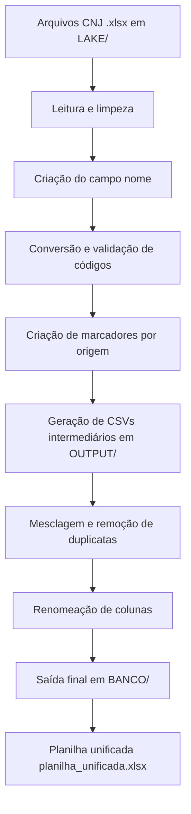

## Visão Geral

Este projeto processa e consolida todos os **códigos TPU do CNJ** referentes a **Assuntos, Movimentos e Classes**, gerando um banco de dados unificado. O script principal (`base.py`) organiza os dados a partir de planilhas fornecidas pelo CNJ e gera arquivos finais `.csv` e uma planilha consolidada `.xlsx`.

---

## Fluxo de Processamento



---

## Estrutura do Projeto

```
.
├── LAKE/
│   ├── Assunto/*.xlsx
│   ├── Movimentos/*.xlsx
│   └── classe/*.xlsx
├── OUTPUT/
│   ├── Assunto/*.csv
│   ├── Movimentos/*.csv
│   └── classe/*.csv
├── BANCO/
│   └── [Assunto|Movimentos|classe]_tpu_nome_marcadores.csv
├── base.py
└── planilha_unificada.xlsx
```

---

## Funcionamento do Script

O script `base.py` executa as seguintes etapas:

1. **Leitura dos arquivos originais** em `LAKE/<tag>/`.
2. **Construção do campo `nome`**: concatena as 5 primeiras colunas originais.
3. **Conversão e limpeza de dados**:

   * Colunas **Código** e **Cód. Pai** → tipo inteiro.
   * Linhas sem valor em `Código` são removidas.
4. **Criação de marcadores**: com base no nome do arquivo, um marcador (`X`) é atribuído.
5. **Exportação de CSVs intermediários** em `OUTPUT/`.
6. **Mesclagem**: une todos os CSVs da categoria, evitando duplicatas.
7. **Renomeação de colunas**:

   * `Código` → `id`
   * `Cód. Pai` → `id_pai`
8. **Saída final por categoria**: arquivos `BANCO/<tag>_tpu_nome_marcadores.csv`.
9. **Consolidação geral**: opcionalmente, gera `planilha_unificada.xlsx`.

---

## Exemplo Real da Saída

A planilha final (`planilha_unificada.xlsx`) e os arquivos `.csv` no diretório `BANCO/` possuem a seguinte estrutura de colunas:

| id   | id_pai | nome                                    | A1 | B2 | C |
| ---- | ------ | --------------------------------------- | -- | -- | - |
| 1001 |        | Direito Civil - Contratos               | X  |    | X |
| 1002 | 1001   | Direito Civil - Obrigações              |    | X  |   |
| 2001 |        | Processo Penal - Crimes Contra a Pessoa | X  |    |   |
| 3005 | 2001   | Processo Penal - Crimes Dolosos         |    |    | X |

> **Observações:**
>
> * As colunas dinâmicas (A1, B2, C...) representam marcadores de origem com um `X`.
> * `id_pai` pode estar vazio quando não existe hierarquia superior.

---

## Execução

Para executar o script:

```bash
python base.py
```

**Pré-requisitos:**

* Python 3.8+
* Bibliotecas: `pandas`, `openpyxl`

Instalação:

```bash
pip install pandas openpyxl
```

---

## Saída Esperada

* Arquivos intermediários em `OUTPUT/`
* Arquivos finais por categoria em `BANCO/`
* Planilha consolidada `planilha_unificada.xlsx` contendo todos os códigos TPU do CNJ processados.

---

## Consolidação Manual (opcional)

Para unir os três arquivos finais em uma única planilha:

```python
import pandas as pd
import glob

files = glob.glob("BANCO/*.csv")
dfs = [pd.read_csv(f) for f in files]

final_df = pd.concat(dfs, ignore_index=True)
final_df.to_excel("planilha_unificada.xlsx", index=False)
```

